# 手語學習平台
# 使用者操作手冊（正式版｜含截圖編號對照）

文件編號：FYP-SL-UG-ZH-002  
版本：v2.0  
語言：繁體中文  
日期：2026-04-19  
適用系統：Web 前端（my-app）

---

## 文件控制
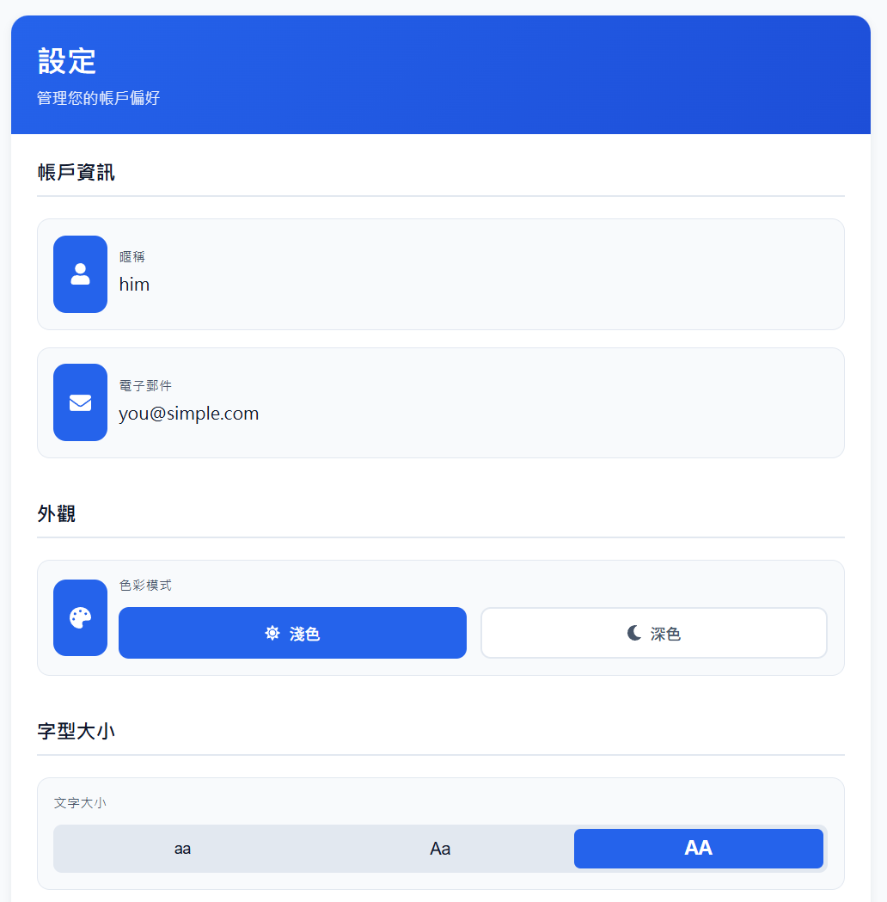

### 版次紀錄
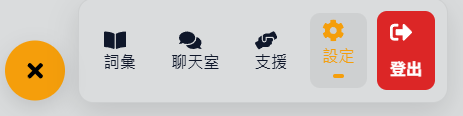

| 版本 | 日期 | 作者 | 變更摘要 |
|---|---|---|---|
| v1.0 | 2026-04-19 | Copilot | 初版（一般操作手冊） |
| v2.0 | 2026-04-19 | Copilot | 正式版排版、加入截圖編號對照、流程化章節 |

### 文件目的


本手冊提供手語學習平台的標準操作說明，供以下用途：
- 用戶培訓與上手
- 示範與專題展示
- 交付文件與維運參考

### 適用對象


- 一般使用者
- 測試人員
- 教學與展示人員

---

## 目錄
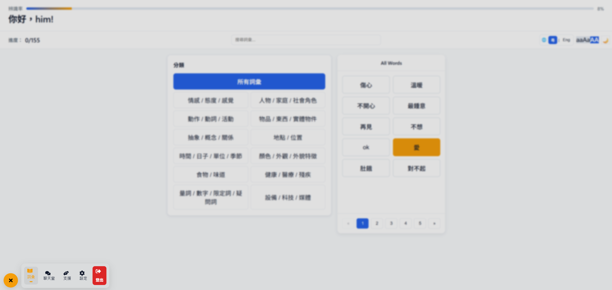

1. 系統簡介  
2. 操作前準備  
3. 導覽與頁面結構  
4. 註冊與登入  
5. 詞彙學習與手勢辨識  
6. 聊天室與句子生成  
7. 支援資源頁  
8. 設定頁  
9. 常見問題與排除  
10. 標準操作流程（SOP）  
11. 附錄（API 與設定鍵值）

---

## 1. 系統簡介
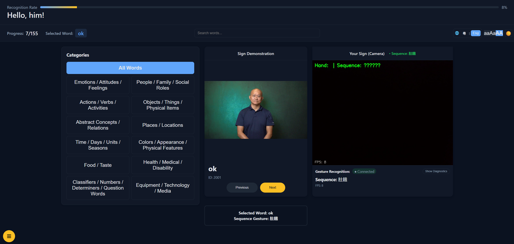

本平台整合「詞彙學習、手勢辨識、句子生成、資源查詢與個人化設定」，協助使用者以互動方式學習手語。

核心功能：
- 手語詞彙分類學習與分頁瀏覽
- 即時攝影機手勢辨識（WebSocket）
- AI 句子生成與手語表達拆解
- 支援資源（NGO／政府／緊急聯絡）
- 無障礙與外觀偏好設定

---

## 2. 操作前準備


### 2.1 環境需求
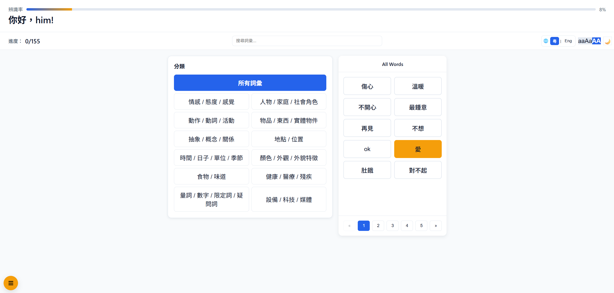

- 瀏覽器：建議 Chrome
- 裝置：可用攝影機
- 網路：可連線資料庫 API 與手勢辨識 API

### 2.2 手勢辨識服務啟動（必要時）
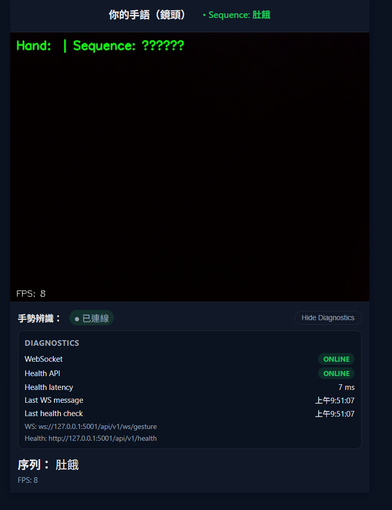

當詞彙頁顯示「連接中 / 離線」時，請啟動 Python 服務：

```bash
py -3.10 app_simple.py
```

建議在 cv_hands 目錄下執行。  
預設端點：
- Health: http://127.0.0.1:5001/api/v1/health
- WebSocket: ws://127.0.0.1:5001/api/v1/ws/gesture

---

## 3. 導覽與頁面結構
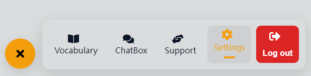

平台頁面：
- 詞彙（Vocabulary）
- 聊天室（Chat Box）
- 支援（Support）
- 設定（Settings）
- 登出（Logout）

操作方式：
- 左下角浮動按鈕可展開/收合導覽選單。
- 點選項目後跳轉到對應頁面。

---

## 4. 註冊與登入
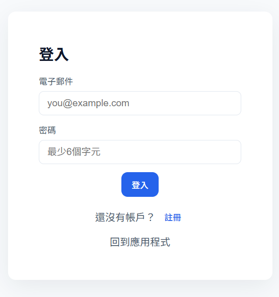

### 4.1 註冊


1. 進入註冊頁。
2. 輸入全名、電子郵件、密碼。
3. 按「建立帳戶」。

### 4.2 登入


1. 進入登入頁。
2. 輸入電子郵件、密碼。
3. 按「登入」。
4. 成功後進入詞彙頁。

### 4.3 驗證規則
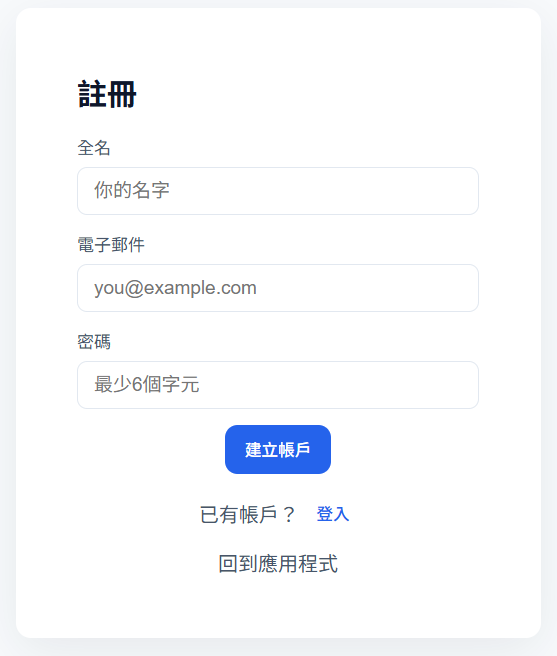

- 電郵須為有效格式（包含 @）
- 密碼至少 6 字元
- 必填欄位不得空白

---

## 5. 詞彙學習與手勢辨識


### 5.1 功能概覽
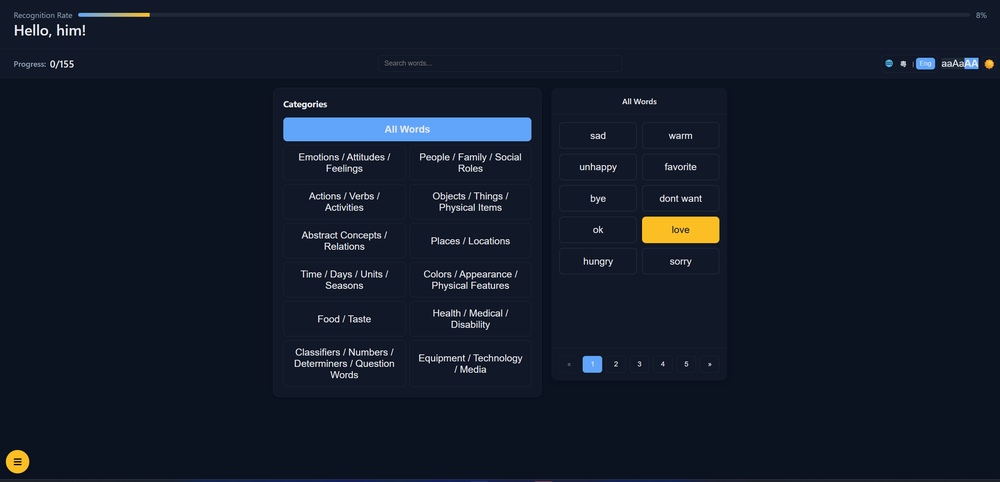

- 辨識率進度條
- 分類與詞彙清單
- 搜尋框與分頁
- 示範影像區
- 相機辨識區
- 診斷資訊區

### 5.2 操作步驟
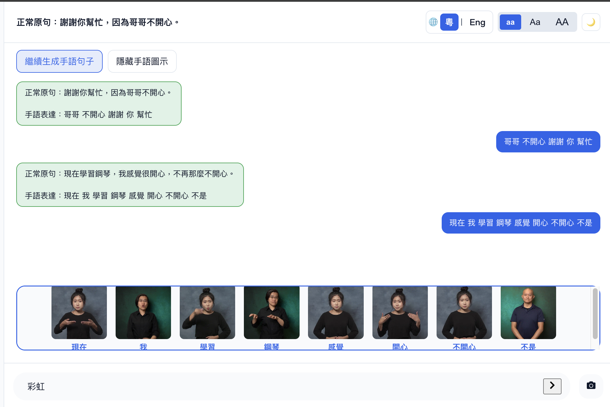

1. 選擇分類（或所有詞彙）。
2. 點選目標詞彙。
3. 查看示範影像。
4. 在相機前做出手勢。
5. 系統辨識序列文字與目標詞彙比對。
6. 匹配成功後自動標記完成並儲存進度。

### 5.3 診斷資訊


可切換顯示以下狀態：
- WebSocket 連線狀態
- Health API 狀態與延遲
- 最後訊息時間戳
- 錯誤訊息

---

## 6. 聊天室與句子生成
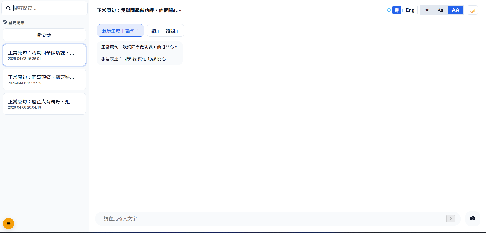

### 6.1 功能概覽
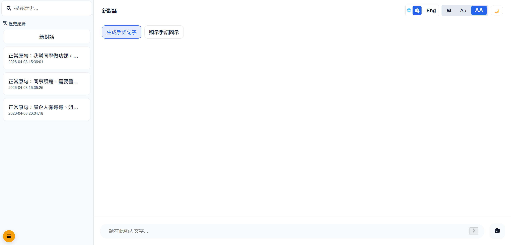

- 左側：歷史紀錄、搜尋、建立新對話
- 右側：句子生成按鈕、聊天泡泡、手語圖示區、輸入列

### 6.2 操作步驟
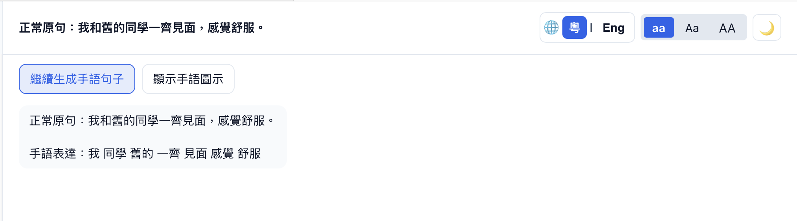

1. 按「生成手語句子」。
2. 系統輸出「正常原句」與「手語表達」。
3. 需要續寫時按「繼續生成手語句子」。
4. 按「顯示手語圖示」查看詞彙圖示列。
5. 可切換「隱藏手語圖示」。
6. 可切換相機模式或鍵盤輸入模式。

### 6.3 對話管理
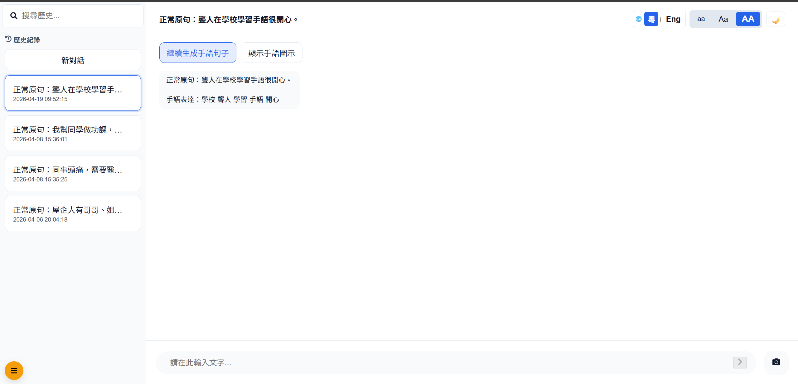

- 可按「新對話」建立新工作階段。
- 可從左側清單載入舊對話。
- 可用搜尋框篩選歷史主題。

---

## 7. 支援資源頁


內容包含：
- 主要非政府組織（NGO）
- 政府相關服務
- 緊急支援資訊

使用方式：
- 點擊卡片中的網址可開啟外部資源。
- 可查閱電話、地址與服務簡介。

---

## 8. 設定頁


### 8.1 可調整項目


- 帳戶資訊（唯讀）
- 色彩模式（淺色 / 深色）
- 字型大小（aa / Aa / AA）
- 無障礙（RG-CVD）
- 語言（繁中 / English）

### 8.2 儲存與登出
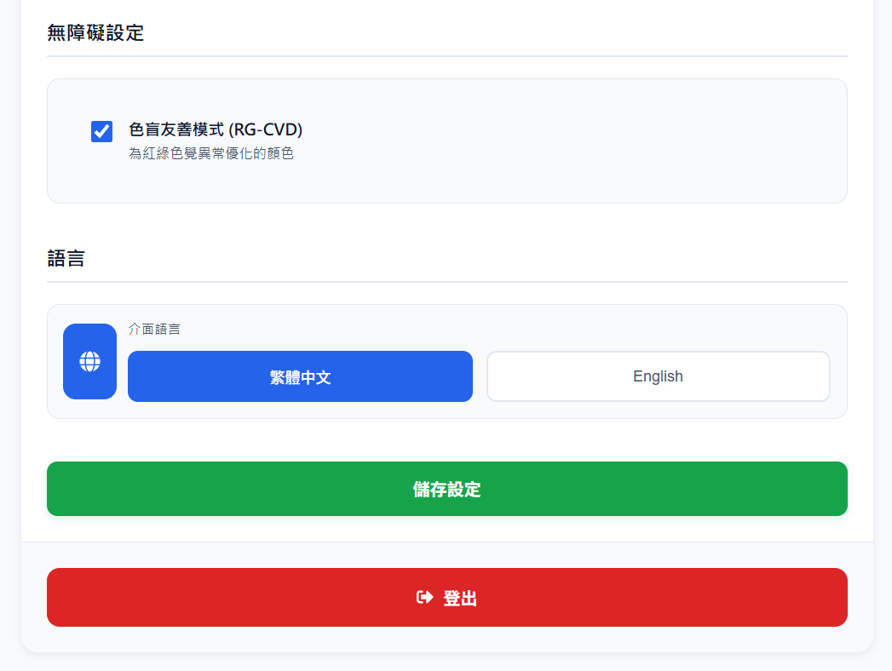

- 有變更時會顯示「儲存設定」按鈕。
- 登出可在設定頁與浮動導覽中執行。

---

## 9. 常見問題與排除
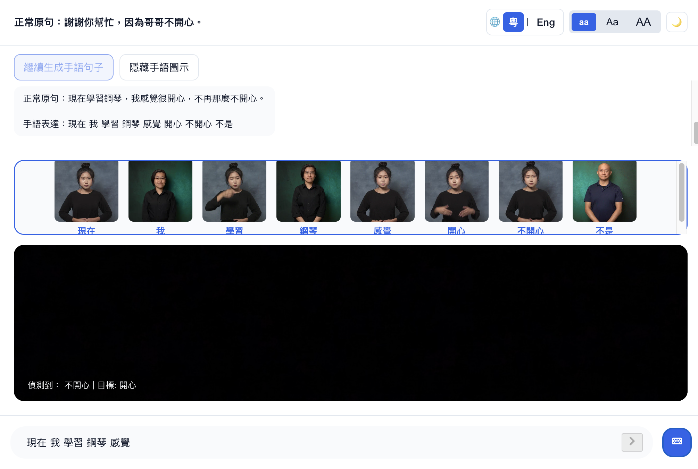

### 9.1 相機畫面異常


- 確認瀏覽器已允許相機權限。
- 重新整理頁面後再試。

### 9.2 詞彙頁顯示連接中


- 確認 Python 手勢服務已啟動。
- 確認 Health API 可連線。

### 9.3 圖示區沒有內容


- 確認已按「顯示手語圖示」。
- 某些詞彙可能無對應圖檔。

### 9.4 生成失敗


- 可能為模型 API 暫時不可用或限流。
- 稍候重試。

---

## 10. 標準操作流程（SOP）


### SOP-01 新用戶首次使用


1. 註冊帳戶。
2. 登入並進入詞彙頁。
3. 在設定頁調整語言、字型、主題。
4. 回詞彙頁完成至少 1 個詞彙辨識。
5. 進入聊天頁完成至少 1 次句子生成。

### SOP-02 課堂展示流程
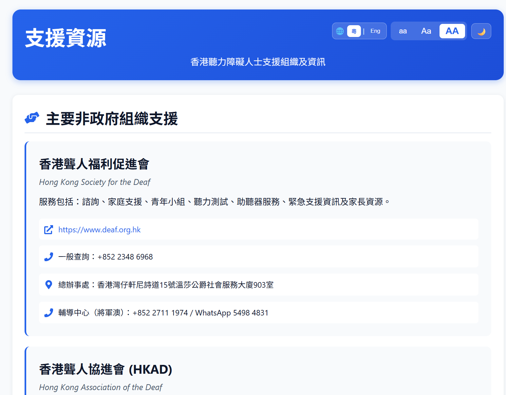

1. 詞彙頁示範分類、搜尋、分頁。
2. 示範相機辨識與匹配成功。
3. 聊天頁示範句子生成與手語圖示。
4. 支援頁示範外部資源查找。

### SOP-03 異常排查流程


1. 先看詞彙頁 Diagnostics。
2. 檢查 Health 與 WebSocket 狀態。
3. 確認 Python 3.10 服務是否運行。
4. 重新整理頁面後復測。

---

## 11. 附錄（API 與偏好設定）


### 11.1 主要 API（前端對接）


- login.php
- get_words.php
- get_webp_for_words.php
- save_progress.php
- get_user_progress.php
- save_chat.php
- get_chat_sessions.php
- get_chat_history.php
- /api/v1/ws/gesture
- /api/v1/health

### 11.2 本機儲存（localStorage）常見鍵
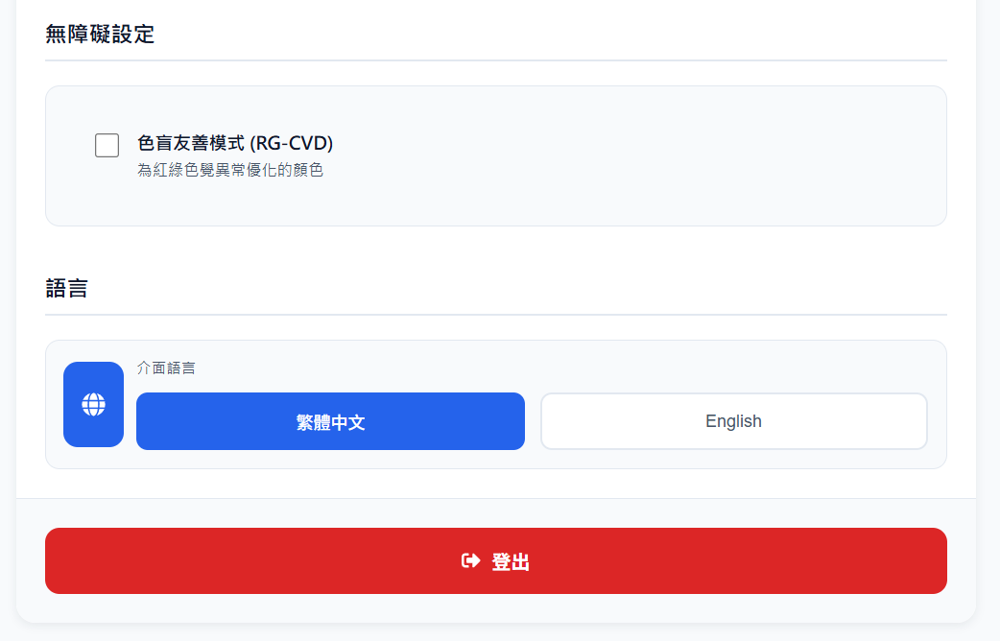

- isAuthenticated
- user / userId / userName
- language
- colorMode
- rgCvdMode
- fontSize
- chatSessionId

---

文件結束